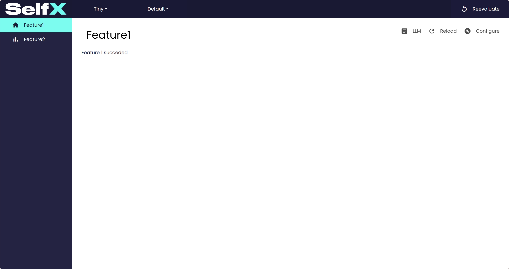
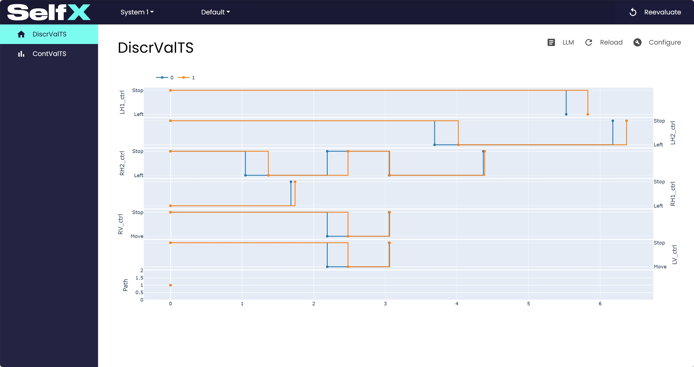

# Getting Started

## Basic usage
```python
--8<-- "selfx/tests/tiny_example.py"
```
### Result:


## Slightly more complicated example

```python
--8<-- "selfx/tests/conveyor_example.py"
```

### Result:
